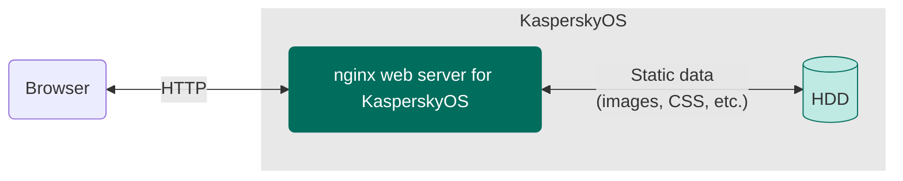

# KasperskyOS nginx example

> An example of a KasperskyOS-based solution using the nginx web server.

## Table of contents
- [KasperskyOS nginx example](#kasperskyos-nginx-example)
  - [Table of contents](#table-of-contents)
  - [Solution overview](#solution-overview)
    - [List of programs](#list-of-programs)
    - [Solution scheme](#solution-scheme)
    - [Initialization description](#initialization-description)
    - [Security policy description](#security-policy-description)
  - [Getting started](#getting-started)
    - [Prerequisites](#prerequisites)
    - [Building the example](#building-the-example)
  - [Usage](#usage)

## Solution overview

### List of programs

* `NetInit`—Program that initializes the network interface `en0`
* `Nginx`—nginx web server ported to KasperskyOS
* `VfsNet`—Networking program
* `Dhcpcd`—DHCP client
* `VfsRamFs`—File system program
* `BSP`—Driver for configuring pin multiplexing parameters (pinmux)
* `GPIO`—GPIO support driver
* `RAMDisk`—Block device driver of a virtual drive in RAM

[⬆ Back to Top](#Table-of-contents)

### Solution scheme



[⬆ Back to Top](#Table-of-contents)

### Initialization description

Statically created IPC channels:

* `netinit.NetInit` → `kl.VfsRamFs`
* `netinit.NetInit` → `kl.VfsNet`
* `nginx.Nginx` → `kl.VfsRamFs`
* `nginx.Nginx` → `kl.VfsNet`
* `kl.VfsNet` → `kl.drivers.BSP`
* `kl.VfsNet` → `kl.drivers.GPIO`
* `kl.rump.Dhcpcd` → `kl.VfsRamFs`
* `kl.rump.Dhcpcd` → `kl.VfsNet`
* `kl.VfsRamFs` → `kl.drivers.RAMDisk`

The [`./kos/example/einit/src/init.yaml.in`](kos/example/einit/src/init.yaml.in) template is used to automatically generate a part of the solution initialization description file `init.yaml`. For more information about the `init.yaml.in` template file, see the [KasperskyOS Community Edition Online Help](https://support.kaspersky.com/help/KCE/1.1/en-US/cmake_yaml_templates.htm).

[⬆ Back to Top](#Table-of-contents)

### Security policy description

The [`./kos/example/einit/src/security.psl`](kos/example/einit/src/security.psl) file contains a solution security policy description. For more information about the `security.psl` file, see [Describing a security policy for a KasperskyOS-based solution](https://support.kaspersky.com/help/KCE/1.1/en-US/ssp_descr.htm).

[⬆ Back to Top](#Table-of-contents)

## Getting started

### Prerequisites

1. Make sure that you have installed the latest version of the [KasperskyOS Community Edition SDK](https://os.kaspersky.com/development/).
1. Set the environment variable `SDK_PREFIX` to `/opt/KasperskyOS-Community-Edition-<version>`, where `version` is the version of the KasperskyOS Community Edition SDK that you installed. To do this, run the following command:
   ```
   $ export SDK_PREFIX=/opt/KasperskyOS-Community-Edition-<version>
   ```

[⬆ Back to Top](#Table-of-contents)

### Building the example

The nginx web server for KasperskyOS is built using the CMake build system, which is provided in the KasperskyOS Community Edition SDK.

To build an example to run on QEMU, go to the directory with the example and run the following command:
```
$ ./cross-build.sh
```
Running `cross-build.sh` creates a KasperskyOS-based solution image that includes the example. The `kos-qemu-image` solution image is located in the `./build/einit` directory.

[./kos/example/netinit/CMakeLists.txt](kos/example/netinit/CMakeLists.txt)—CMake commands for building the `NetInit` program.

[./kos/example/einit/CMakeLists.txt](kos/example/einit/CMakeLists.txt)—CMake commands for building the `Einit` program and the solution image.

[./kos/example/CMakeLists.txt](kos/example/CMakeLists.txt)—CMake commands for building the solution.

[⬆ Back to Top](#Table-of-contents)

## Usage

1. To run the example on QEMU, go to the directory `./kos/example` and run the following command:
   ```
   $ ./cross-build.sh
   ```
   For more information about running example on Raspberry Pi 4 B, see the [KasperskyOS Community Edition Online Help](https://support.kaspersky.com/help/KCE/1.1/en-US/running_sample_programs_rpi.htm).
1. Wait until a message like this appears in the standard output:
    ```
    en0: adding default route via 10.0.2.2
    ```
1. Open the link <http://localhost:8000> in your browser.
1. The page with the title "KasperskyOS Nginx" and six images should open.

[⬆ Back to Top](#Table-of-contents)
